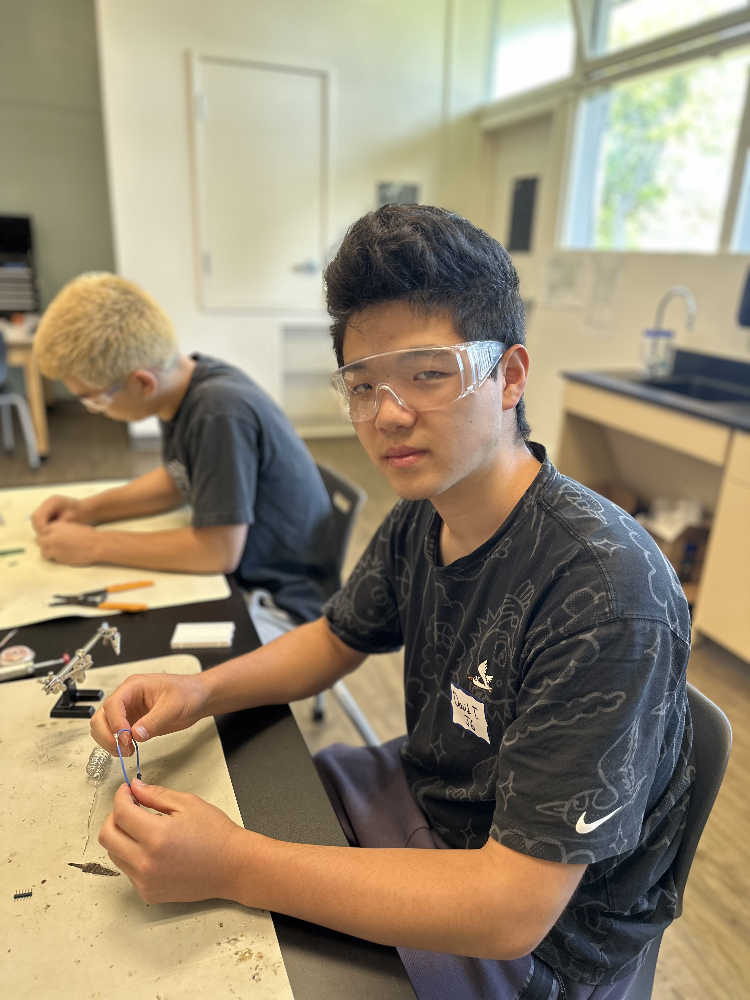
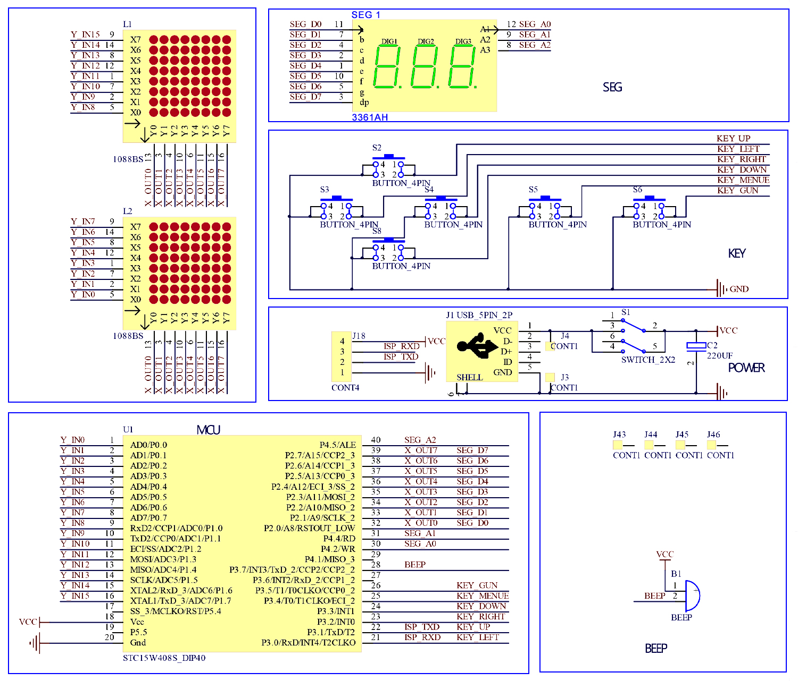

# Portable Crypto Tracker
<!--
Replace this text with a brief description (2-3 sentences) of your project. This description should draw the reader in and make them interested in what you've built. You can include what the biggest challenges, takeaways, and triumphs from completing the project were. As you complete your portfolio, remember your audience is less familiar than you are with all that your project entails!
-->

| **Engineer** | **School** | **Area of Interest** | **Grade** |
|:--:|:--:|:--:|:--:|
| David T | Gunn High School | Engineering | Incoming Junior




<!-- 
# Final Milestone

**Don't forget to replace the text below with the embedding for your milestone video. Go to Youtube, click Share -> Embed, and copy and paste the code to replace what's below.**

<iframe width="560" height="315" src="https://www.youtube.com/embed/F7M7imOVGug" title="YouTube video player" frameborder="0" allow="accelerometer; autoplay; clipboard-write; encrypted-media; gyroscope; picture-in-picture; web-share" allowfullscreen></iframe>

For your final milestone, explain the outcome of your project. Key details to include are:
- What you've accomplished since your previous milestone
- What your biggest challenges and triumphs were at BSE
- A summary of key topics you learned about
- What you hope to learn in the future after everything you've learned at BSE


# Second Milestone

**Don't forget to replace the text below with the embedding for your milestone video. Go to Youtube, click Share -> Embed, and copy and paste the code to replace what's below.**

<iframe width="560" height="315" src="https://www.youtube.com/embed/y3VAmNlER5Y" title="YouTube video player" frameborder="0" allow="accelerometer; autoplay; clipboard-write; encrypted-media; gyroscope; picture-in-picture; web-share" allowfullscreen></iframe>

For your second milestone, explain what you've worked on since your previous milestone. You can highlight:
- Technical details of what you've accomplished and how they contribute to the final goal
- What has been surprising about the project so far
- Previous challenges you faced that you overcame
- What needs to be completed before your final milestone 

# First Milestone

**Don't forget to replace the text below with the embedding for your milestone video. Go to Youtube, click Share -> Embed, and copy and paste the code to replace what's below.**

<iframe width="560" height="315" src="https://www.youtube.com/embed/CaCazFBhYKs" title="YouTube video player" frameborder="0" allow="accelerometer; autoplay; clipboard-write; encrypted-media; gyroscope; picture-in-picture; web-share" allowfullscreen></iframe>

For your first milestone, describe what your project is and how you plan to build it. You can include:
- An explanation about the different components of your project and how they will all integrate together
- Technical progress you've made so far
- Challenges you're facing and solving in your future milestones
- What your plan is to complete your project

# Schematics 
Here's where you'll put images of your schematics. [Tinkercad](https://www.tinkercad.com/blog/official-guide-to-tinkercad-circuits) and [Fritzing](https://fritzing.org/learning/) are both great resoruces to create professional schematic diagrams, though BSE recommends Tinkercad becuase it can be done easily and for free in the browser. 

# Code
Here's where you'll put your code. The syntax below places it into a block of code. Follow the guide [here]([url](https://www.markdownguide.org/extended-syntax/)) to learn how to customize it to your project needs. 

```c++
void setup() {
  // put your setup code here, to run once:
  Serial.begin(9600);
  Serial.println("Hello World!");
}

void loop() {
  // put your main code here, to run repeatedly:

}
```
-->
# Bill of Materials

| **Part** | **Note** | **Price** | **Link** |
|:--:|:--:|:--:|:--:|
| 5 Pcs 0.96 Inch OLED I2C IIC Display Module 12864 128x64 Pixel SSD1306 Mini Self-Luminous OLED Screen Board Compatible with Arduino Raspberry PiBlue and Yellow | What the item is used for | $14.98 | <a href="https://www.amazon.com/Hosyond-Display-Self-Luminous-Compatible-Raspberry/dp/B09C5K91H7?dib=eyJ2IjoiMSJ9.Oj7-44A7lyakrMHjnHXgeRLFJ_1E0IiPJp46XUZn1tZLog59ynaGxd5bKdcuwxQFDkrpQEH_qJ7d_q5D54b92MW4KRME01YATJQ0-upnkqaPIeSYMPaO9LR0umnxZYodqn2MKDR1bT-YPMssOK7gfldjOB6b7wX5Sy51dugYWXcKPEkSJCtQtUlGfnDa__QyVRVZT-2WMlDwZURfbzCvssU6nSmUtfC_GHfa0d5hA7Q.ckrHa4OhznR_TfY7lUJ5FBHISxaTQp2DJxJOtS18utU&dib_tag=se&keywords=oled%2Bscreen%2Besp32&qid=1745067203&sr=8-3&th=1&linkCode=sl1&tag=sonbrooks03-20&linkId=f4c972aa5b8b08c8f26785ad6844bd95&language=en_US&ref_=as_li_ss_tl/"> Link </a> |
| ELEGOO 3PCS ESP-32 Development Board USB-C, 2.4GHz Dual Mode WiFi+Bluetooth Dual Core Microcontroller for Arduino IDE, Support AP/STA/AP+STA, CP2102 Chip | What the item is used for | $19.99| <a href="https://www.amazon.com/ELEGOO-ESP-WROOM-32-Development-Bluetooth-Microcontroller/dp/B0D8T53CQ5?_encoding=UTF8&pd_rd_w=eyS5O&content-id=amzn1.sym.255b3518-6e7f-495c-8611-30a58648072e:amzn1.symc.a68f4ca3-28dc-4388-a2cf-24672c480d8f&pf_rd_p=255b3518-6e7f-495c-8611-30a58648072e&pf_rd_r=FTH9C3WE9P7XJS3CG5K9&pd_rd_wg=LbCOQ&pd_rd_r=c6647957-9863-4a27-8133-81c3b2407a24&linkCode=sl1&tag=sonbrooks03-20&linkId=635417aef7cbe2ffa06186d2c97c6f91&language=en_US&ref_=as_li_ss_tl/"> Link </a> |

--!>
# Other Resources/Examples
One of the best parts about Github is that you can view how other people set up their own work. Here are some past BSE portfolios that are awesome examples. You can view how they set up their portfolio, and you can view their index.md files to understand how they implemented different portfolio components.
- [Example 1](https://trashytuber.github.io/YimingJiaBlueStamp/)
- [Example 2](https://sviatil0.github.io/Sviatoslav_BSE/)
- [Example 3](https://arneshkumar.github.io/arneshbluestamp/)

To watch the BSE tutorial on how to create a portfolio, click here.
-->
# Starter Project: Retro Game Soldering

 <iframe width="560" height="315" src="https://www.youtube.com/embed/DP_EGq8dyFk?si=OWw0ru3kLL2O6_Ll" title="YouTube video player" frameborder="0" allow="accelerometer; autoplay; clipboard-write; encrypted-media; gyroscope; picture-in-picture; web-share" referrerpolicy="strict-origin-when-cross-origin" allowfullscreen></iframe>

  For my starter project, I built a retro handheld game console using a soldering kit. This project took me 6-7 continuous working hours. This device allows me to play classic video games such as Tetris, Snake, and a few others programmed into the system. I learned the basics of soldering of a spare and empty PCB Prited Circut Board and how not to create a short which would be a faulty solder. When building this project, I practiced my soldering skills and I got a lot of practice learning how to solder all the little pieces together. Furthermore, when building this project, I ran into the struggle of a improper solder from a wire connecting the battery to a the main game board which would power the whole system. I fixed this issue by desoldering copper wick and soldered this to the main board with more detail which was caused the system to work later on. The project consisted of three AAA batteries to power the whole system or an optional port could be used to power the system.   




 
