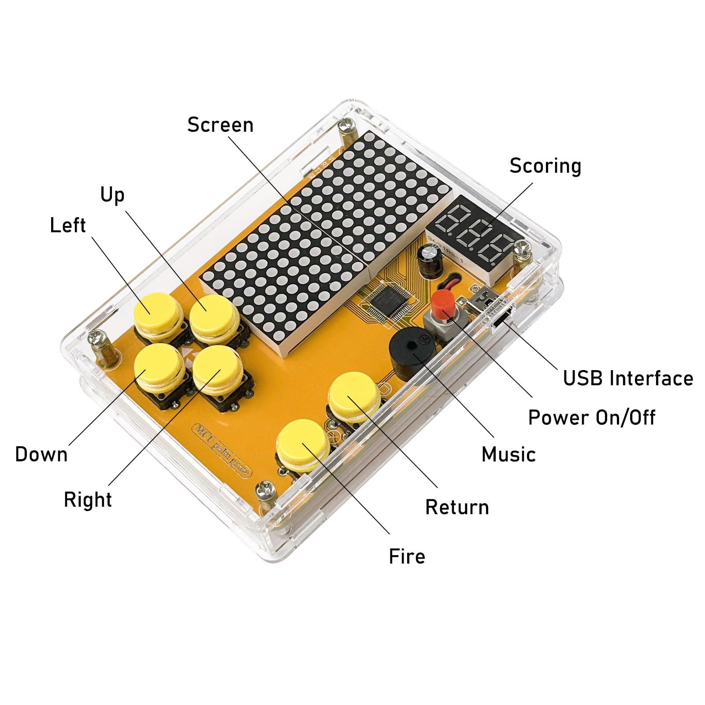

# Portable Crypto Tracker
<!--

Replace this text with a brief description (2-3 sentences) of your project. This description should draw the reader in and make them interested in what you've built. You can include what the biggest challenges, takeaways, and triumphs from completing the project were. As you complete your portfolio, remember your audience is less familiar than you are with all that your project entails!
-->

| **Engineer** | **School** | **Area of Interest** | **Grade** |
|:--:|:--:|:--:|:--:|
| David T | Gunn High School | Mechanical Engineering | Incoming Junior


<!-- 
# Final Milestone

<iframe width="560" height="315" src="https://www.youtube.com/embed/GhcfAWI-Z7g?si=xb-wTWlhdn3fZ-kh" title="YouTube video player" frameborder="0" allow="accelerometer; autoplay; clipboard-write; encrypted-media; gyroscope; picture-in-picture; web-share" referrerpolicy="strict-origin-when-cross-origin" allowfullscreen></iframe>

### Introduction: 
For my thrid milestone, I needed to add the live price of Bitcoin to my system and had to display that data live on my screen. On this milestone, I also had to add a historical cost to compare to the current cost to find the percentage change. This milestone was the most software extensive in my project, as I had to write program to actually broadcast the data of the price and the percentage change. This adds on to the second milestone as I started to display live data of Bitcoin prices in USD and started to calculate the live percentage change of Bitcoin prices. 
### Explanation:
I added a new URL for live price of Bitcoin because coindesk added a new version of their API. So I had to replace it with a V2 url. I had to change most of my codes API to access the same data under a different name. This was a lot of work as not all of the previous code was compatible with the new coindesk API. Additionally, I had to update and change my data array to collect a different value from the updated Json. In addition, I had to rewrite the percentage change values to adjust for the new definitions of the new API. I used the same formula, but I had to replace the new values from coindesk to make the formula work. In addition to these new updates, I had to display new API's using serial.print or serial.println to check that my program was returning the correct values. 
### Challenges:

### Takeaways: 

For your final milestone, explain the outcome of your project. Key details to include are:
- What you've accomplished since your previous milestone
- What your biggest challenges and triumphs were at BSE
- A summary of key topics you learned about
- What you hope to learn in the future after everything you've learned at BSE

-->

# Second Milestone

<iframe width="560" height="315" src="https://www.youtube.com/embed/Vj-Z61Cwg_E?si=H52o0yMvw7W2TUA9" title="YouTube video player" frameborder="0" allow="accelerometer; autoplay; clipboard-write; encrypted-media; gyroscope; picture-in-picture; web-share" referrerpolicy="strict-origin-when-cross-origin" allowfullscreen></iframe>

### Introduction: 
For my second milestone, I ran test code through the system to check if the system actually works. It actually works except that it doesn't display text in white, only in yellow and blue as those are the screen's restrictions. My second milestone was very software intensive and did not require me to do anything with hardware. For this milestone, I found test code which uses ESP-32 and controls the 0.96 OLED display. When I downloaded all of the libraries and ran the code, it worked flawlessly. I then explained the components like the ESP-32 and the connection protocols.

### Explanation:
The system sits on a breadboard which allows connections of circuits and systems to be connected. GND and VCC allow a transfer of power to the screens and CPU itself. SCL and SDA connections allow the communication of data between the CPU or the ESP32 to communicate with the OLED screen. This uses I2C(I squared c protocol) using ports SCL and SDA. The Serial Clock (SCL) is the clock line that synchronizes data transfers between devices. It turns on and off at a constant rate defining the timing intervals. This ensures accurate tracking of the number of bits transmitted over a given period. The SDA or (Serial data) runs in tandem with the SCL so the SDA knows what time interval it is broadcasting in. The SDA connection transfers data or bits from the CPU to the OLED display. Both SCL and SDA run in digital sequence displaying only on or off. This is a controller-target relationship as the CPU tells the screen what to display and the target or the screen, has to follow the commands of the microcontroller. The other two connections which are GND and VCC which is how the screen gets power to display things. The ESP32 is a series of microcontrollers that run in analog, it has the ability to connect a system to wifi and bluetooth through a radio controller. This allows connection with the internet. It has two 32 bit Xtensa LX6 which runs up to 240 Megahertz and it has 512 kilobytes of SRAM that runs alongside with other types of ram. The  ESP32 also has the ability to connect to wifi allowing it to access the web. 

### Challenges:
A challenge I faced while completing my second milestone was implementing test code to run. Finding code that was compatible with the 0.96 OLED and with the ESP32 was a bit of a challenge because it was quite a specific task. Another challenge was figuring out how to implement secret.h into my code as a different environment. This other environment allowed me to store the WiFi SSID and password elsewhere to keep them safe from unauthorized people. Lastly, the largest problem I had was learning all about the ESP32 and how if functioned with other things such as an OLED display.  

### Future Progress: 
It also has bluetooth allowing data transfers without physically connecting to other devices with a cable. In conclusion, the ESP32 is a microcontroller which allows the system to run the instructions given by a programmer. For my next milestone, I will integrate an API from Coindesk into my code and start tracking live data given from Coindesk and translating that onto a screen on my tracker.  
 


# First Milestone

<iframe width="560" height="315" src="https://www.youtube.com/embed/Wf0zbqYmePA?si=O_YHtgXLAGattQjm" title="YouTube video player" frameborder="0" allow="accelerometer; autoplay; clipboard-write; encrypted-media; gyroscope; picture-in-picture; web-share" referrerpolicy="strict-origin-when-cross-origin" allowfullscreen></iframe>

### Introduction:
For my portable crypto tracker, I needed to physically install a controller so that the whole system knows what to run and what to do. This controller was the ESP32, this is the brains of the whole system. On this board, there is an integrated power supply where it accepts ay USB-C cable connection providing it with power. The OLED display is a 0.96 inch display which can only provide color in yellow and blue. I connected the ESP32 and OLED display with wires that allow power and data to be transferred from the ESP32 to the OLED display. 

### Explanation:
I stuck the ESP32 and the OLED display into the breadboard while following the instructions of the schematic. I then connected the wires by using the schematic as a guide, however, I found an error as the schematic had an extra row which I didn't have so I placed a wire over a bit which allowed the power to flow and it avoided a possible short. The blue and green cables provide information from the ESP32 to the OLED display while the red and black and a single blue cable provide power flowing in an orderly way so the whole system doesn't short. The ESP32 board also provides power for the whole board and to the display. A challenge I faced while putting together the project was that the breadboard did not have enough holes so assembling the components was slightly misaligned. As a result, the data transfer cable had to be stacked next to eachother which was slightly different than the provided schematic.

### Future Progress:
I need to check if my OLED display works with my ESP32. As a result, I will most likely use some sort of test code on the web just to check that my system works overall. I think this is part of my second milestone alongside learning what the components of my system actually are and what they do. My plan to complete my project is to make sure my system works with test code. If my system works, I think I will start to integrate actual code to track live data of Bitcoin. 


# Schematics 
 
 
 Schemnatic of my final project 


# Code
Here's where you'll put your code. The syntax below places it into a block of code. Follow the guide [here]([url](https://www.markdownguide.org/extended-syntax/)) to learn how to customize it to your project needs. 


# Bill of Materials

| **Part** | **Note** | **Price** | **Link** |
|:--:|:--:|:--:|:--:|
| 5 Pcs 0.96 Inch OLED I2C IIC Display Module 12864 128x64 Pixel SSD1306 Mini Self-Luminous OLED Screen Board Compatible with Arduino Raspberry PiBlue and Yellow | For displaying information. | $14.98 | <a href="https://www.amazon.com/Hosyond-Display-Self-Luminous-Compatible-Raspberry/dp/B09C5K91H7?dib=eyJ2IjoiMSJ9.Oj7-44A7lyakrMHjnHXgeRLFJ_1E0IiPJp46XUZn1tZLog59ynaGxd5bKdcuwxQFDkrpQEH_qJ7d_q5D54b92MW4KRME01YATJQ0-upnkqaPIeSYMPaO9LR0umnxZYodqn2MKDR1bT-YPMssOK7gfldjOB6b7wX5Sy51dugYWXcKPEkSJCtQtUlGfnDa__QyVRVZT-2WMlDwZURfbzCvssU6nSmUtfC_GHfa0d5hA7Q.ckrHa4OhznR_TfY7lUJ5FBHISxaTQp2DJxJOtS18utU&dib_tag=se&keywords=oled%2Bscreen%2Besp32&qid=1745067203&sr=8-3&th=1&linkCode=sl1&tag=sonbrooks03-20&linkId=f4c972aa5b8b08c8f26785ad6844bd95&language=en_US&ref_=as_li_ss_tl/"> Link </a> |
| ELEGOO 3PCS ESP-32 Development Board USB-C, 2.4GHz Dual Mode WiFi+Bluetooth Dual Core Microcontroller for Arduino IDE, Support AP/STA/AP+STA, CP2102 Chip | This chip tells the OLED display what to do and how to do it. | $19.99| <a href="https://www.amazon.com/ELEGOO-ESP-WROOM-32-Development-Bluetooth-Microcontroller/dp/B0D8T53CQ5?_encoding=UTF8&pd_rd_w=eyS5O&content-id=amzn1.sym.255b3518-6e7f-495c-8611-30a58648072e:amzn1.symc.a68f4ca3-28dc-4388-a2cf-24672c480d8f&pf_rd_p=255b3518-6e7f-495c-8611-30a58648072e&pf_rd_r=FTH9C3WE9P7XJS3CG5K9&pd_rd_wg=LbCOQ&pd_rd_r=c6647957-9863-4a27-8133-81c3b2407a24&linkCode=sl1&tag=sonbrooks03-20&linkId=635417aef7cbe2ffa06186d2c97c6f91&language=en_US&ref_=as_li_ss_tl/"> Link </a> |
|1 PCS Breadboard 830 Point Solderless Prototype PCB Board Kit for Arduino Proto Shield Distribution Connecting Blocks | This item is a platform allowing power to transfer and it allows the ESP-32 and the OLED display a place to stay on. | $3.99| <a href="https://www.amazon.com/California-JOS-Breadboard-Solderless-Distribution/dp/B0BRQX6G3T/ref=asc_df_B0BRQX6G3T?mcid=3f02ed1993843f2c90966ba247f34f63&hvocijid=5747427556118091865-B0BRQX6G3T-&hvexpln=73&tag=hyprod-20&linkCode=df0&hvadid=721245378154&hvpos=&hvnetw=g&hvrand=5747427556118091865&hvpone=&hvptwo=&hvqmt=&hvdev=c&hvdvcmdl=&hvlocint=&hvlocphy=9032171&hvtargid=pla-2281435177898&th=1"> Link </a> |
|40 PCS 20 CM (8 inch) Breadboard Jumper Wires Length Optional Dupont Wire Assorted Kit Male to Male Multicolored Ribbon Cables | This item is used for connecting power from the ESP-32 to the screen. It also allows data to be transfered from the ESP-32 to the OLED | $3.99| <a href="https://www.amazon.com/California-JOS-Breadboard-Optional-Multicolored/dp/B0BRTJQZRD/ref=asc_df_B0BRTJQZRD?mcid=5398d876283e3735ba72e24ca978b618&hvocijid=3703053914025575986-B0BRTJQZRD-&hvexpln=73&tag=hyprod-20&linkCode=df0&hvadid=721245378154&hvpos=&hvnetw=g&hvrand=3703053914025575986&hvpone=&hvptwo=&hvqmt=&hvdev=c&hvdvcmdl=&hvlocint=&hvlocphy=9032171&hvtargid=pla-2281435179098&th=1"> Link </a> |

```c++
https://www.markdownguide.org/extended-syntax/#include <Adafruit_SSD1306.h>
#include <WiFi.h>
#include <Wire.h>
#include <HTTPClient.h>
#include <NTPClient.h>
#include <WiFiUdp.h>
#include "secrets.h"  // WiFi Configuration (WiFi name and Password)
#include <ArduinoJson.h>
#define SCREEN_WIDTH 128     // OLED display width, in pixels
#define SCREEN_HEIGHT 64     // OLED display height, in pixels
#define OLED_RESET -1        // Reset pin # (or -1 if sharing Arduino reset pin)
#define SCREEN_ADDRESS 0x3C  ///< See datasheet for Address; 0x3D for 128x64, 0x3C for 128x32
Adafruit_SSD1306 display(SCREEN_WIDTH, SCREEN_HEIGHT, &Wire, OLED_RESET);

const char* ssid = SSID;
const char* password = WIFI_PASSWORD;

const int httpsPort = 443;
// Powered by CoinDesk -
const String url = "https://min-api.cryptocompare.com/data/price?fsym=BTC&tsyms=USD";
const String historyURL = "https://min-api.cryptocompare.com/data/v2/histoday?fsym=BTC&tsym=USD&limit=1";
const String cryptoCode = "BTC";

WiFiClient client;
HTTPClient http;

// Variables to save date and time
String formattedDate;
String dayStamp;
String timeStamp;

bool test = true;

void setup() {
  Serial.begin(115200);

  if (!display.begin(SSD1306_SWITCHCAPVCC, SCREEN_ADDRESS)) {
    Serial.println(F("SSD1306 allocation failed"));
    for (;;)
      ;  // Don't proceed, loop forever
  }

  display.clearDisplay();
  display.setTextSize(1);
  display.setTextColor(WHITE);
  display.println("Connecting to WiFi...");
  display.display();

  WiFi.begin(ssid, password);

  Serial.print("Connecting to WiFi...");
  while (WiFi.status() != WL_CONNECTED) {
    delay(500);
    Serial.print(".");
  }
  Serial.println();

  display.println("Connected to: ");
  display.print(ssid);
  display.display();
  delay(1500);
  display.clearDisplay();
  display.display();
}

void loop() {
  double currentPrice = 0.0;    // Initialize to 0.0 for safety
  double yesterdayPrice = 0.0; // Initialize to 0.0 for safety

  // --- 1. Fetch Current Price ---
  //Serial.print("Fetching current price from: ");
  //Serial.println(url);

  http.begin(url);
  int httpCode = http.GET();
  StaticJsonDocument<200> doc; // Smaller buffer is fine for this simple JSON
  DeserializationError error = deserializeJson(doc, http.getString());


  if (httpCode == HTTP_CODE_OK) { // Check HTTP status first
    if (error) {
      Serial.print(F("deserializeJson Failed (Current Price): "));
      Serial.println(error.f_str());
    } else {
      currentPrice = doc["USD"].as<double>(); // Direct conversion to double
      Serial.print("Current Price (USD): ");
      Serial.println(currentPrice, 2); // Print with 2 decimal places
    }
  } else {
    Serial.print("HTTP Request Failed (Current Price) with code: ");
    Serial.println(httpCode);
    Serial.println("Response: " + http.getString());
  }
  http.end(); // Close the HTTP connection for current price

  // --- 2. Fetch Historical Data ---
  Serial.print("Fetching historical data from: ");
  Serial.println(historyURL);

  // Use a larger buffer for historical data (array of objects)
  StaticJsonDocument<4000> historyDoc; // 4000 bytes should be sufficient for limit=10 (11 entries)
  http.begin(historyURL);
  int historyHttpCode = http.GET();
  DeserializationError historyError = deserializeJson(historyDoc, http.getString());

    if (historyHttpCode == HTTP_CODE_OK) { // Check HTTP status first
      if (historyError) {
        Serial.print(F("deserializeJson Failed (History): "));
        Serial.println(historyError.f_str());
      } else {
        Serial.print("History HTTP Status Code: ");
        Serial.println(historyHttpCode);

        // Correctly access the "Data" array nested within the "Data" object.
        // The variable historicalDataArray is correctly declared as JsonArray.
        JsonArray historicalDataArray = historyDoc["Data"]["Data"].as<JsonArray>();
        for (JsonVariant close : historicalDataArray) {
          Serial.println(close.as<JsonObject>()["close"].as<double>());//Prints the closing price of todays price. 
        }


        // Check if the array contains at least two data points (yesterday and today).
        if (historicalDataArray.size() >= 2) {
          // The last element (index size - 1) is typically the most recent day (current partial day).
          // The second to last element (index size - 2) is the last complete day (yesterday's close).
          // Access the specific JsonObject for yesterday, then its "close" field.
          yesterdayPrice = historicalDataArray[historicalDataArray.size() - 2 ]["close"].as<double>();
          Serial.print("Yesterday's Close Price (from history): ");
          Serial.println(yesterdayPrice, 2); // Print with 2 decimal places
          //test = false;
        } else {
          Serial.println("Not enough historical data points to determine yesterday's price.");
          // yesterdayPrice remains 0.0 if not enough data, which is handled by subsequent checks.
        }
      }
    } else {
      Serial.print("HTTP Request Failed (History) with code: ");
      Serial.println(historyHttpCode);
      Serial.println("Response: " + http.getString());
    }
  //}

  http.end(); // Close the HTTP connection for historical data

  // --- 3. Calculate and Display Percent Change ---
  // Ensure we have valid data (prices are greater than 0) before calculating percent change
  
  if (currentPrice > 0 && yesterdayPrice > 0) {
    bool isUp = (currentPrice >= yesterdayPrice); // Use >= to include no change as 'up'
    double percentChange;

    if (yesterdayPrice != 0) { // Safety check against division by zero
      if (isUp) {
        percentChange = ((currentPrice - yesterdayPrice) / yesterdayPrice) * 100.0;
      } else {
        percentChange = ((yesterdayPrice - currentPrice) / yesterdayPrice) * 100.0;
      }
    } else {
      percentChange = 0.0; // Cannot calculate if yesterdayPrice is zero
      Serial.println("Error: yesterdayPrice is zero, cannot calculate percentage change.");
    }

    Serial.print("Percent Change: ");
    Serial.println(percentChange, 2); // Print with 2 decimal places
    
    // --- Display on OLED ---
    display.clearDisplay();
    display.setTextSize(1);
    display.setTextColor(WHITE);
    printCenter("BTC/USD", 0, 0);

    display.setTextSize(2);
    printCenter("$" + String(currentPrice, 2), 0, 25); // Display current price, formatted to 2 decimal places

    String dayChangeString = "24hr. Change: ";
    if (!isUp) { // If price went down, add '-'
      dayChangeString += "-";
    }
    dayChangeString += String(percentChange, 2) + "%"; // Display percentage change, formatted to 2 decimal places
    display.setTextSize(1);
    printCenter(dayChangeString, 0, 55);
    display.display();

  } else {
    // If data fetching failed or insufficient, display an error message
    Serial.println("Insufficient data to calculate and display price change.");
    display.clearDisplay();
    display.setTextSize(1);
    display.setTextColor(WHITE);
    display.println("Data fetch failed");
    display.println("or insufficient.");
    display.display();
  }
  
  delay(5000); // Wait 5 seconds before next update cycle
  
}

void printCenter(const String buf, int x, int y) {
  int16_t x1, y1;
  uint16_t w, h;
  display.getTextBounds(buf, x, y, &x1, &y1, &w, &h);  //calc width of new string
  display.setCursor((x - w / 2) + (SCREEN_WIDTH / 2), y);
  display.print(buf);
}

```


<!--
# Other Resources/Examples
One of the best parts about Github is that you can view how other people set up their own work. Here are some past BSE portfolios that are awesome examples. You can view how they set up their portfolio, and you can view their index.md files to understand how they implemented different portfolio components.
- [Example 1](https://trashytuber.github.io/YimingJiaBlueStamp/)
- [Example 2](https://sviatil0.github.io/Sviatoslav_BSE/)
- [Example 3](https://arneshkumar.github.io/arneshbluestamp/)

To watch the BSE tutorial on how to create a portfolio, click here.
-->
# Starter Project: Retro Game Soldering

 <iframe width="560" height="315" src="https://www.youtube.com/embed/DP_EGq8dyFk?si=OWw0ru3kLL2O6_Ll" title="YouTube video player" frameborder="0" allow="accelerometer; autoplay; clipboard-write; encrypted-media; gyroscope; picture-in-picture; web-share" referrerpolicy="strict-origin-when-cross-origin" allowfullscreen></iframe>

For my starter project, I built a retro handheld game console using a soldering kit. This project took me 6-7 continuous working hours. This device allows me to play classic video games such as Tetris, Snake, and a few others programmed into the system. I learned the basics of soldering of a spare and empty PCB Printed Circuit Board and how not to create a short which would be a faulty solder. When building this project, I practiced my soldering skills and I got a lot of practice learning how to solder all the little pieces together. Furthermore, when building this project, I ran into the struggle of an improper solder from a wire connecting the battery to the main game board which would power the whole system. I fixed this issue by using desoldering wick to remove the old solder and then soldered the wire to the main board with more detail, which allowed the system to work flawlessly. The project consisted of three AAA batteries to power the whole system or an optional port could be used to power the system.   





[Schematic for Retro Game Soldering kit](https://www.hackster.io/lewisdiy/build-your-own-game-console-kit-play-the-classic-games-5ca95f)

[Image of Retro Game Soldering kit components](https://www.hackster.io/lewisdiy/build-your-own-game-console-kit-play-the-classic-games-5ca95f)

[Bitcoin Price comparison ](https://www.coindesk.com/price/bitcoin)

[Live Price API from Coindesk](https://developers.coindesk.com/documentation/legacy/Price/SingleSymbolPriceEndpoint)

[24 Hour price change API from Coindesk](https://developers.coindesk.com/documentation/legacy/Historical/dataHistoday)

[Bitcoin ticker ESP32](https://github.com/AndrewBudziszek/bitcoin-ticker-esp32/tree/main)
